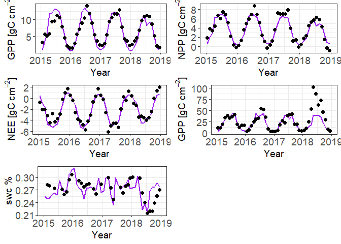
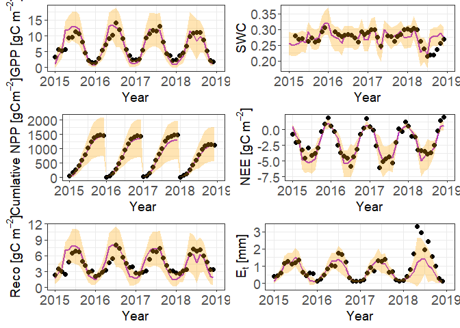
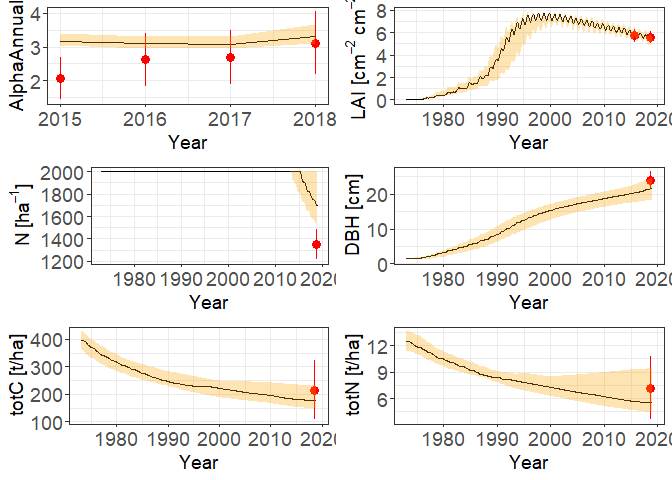

Readme
================

# Installation

Open the file or load the package from within R studio "SoNWaL.proj"

run the following command to install the package:

``` r
devtools::install()
```

# Run the model and plot some quick outputs

## Setup

Firstly setup the data for running the model:

-   load in required packages
-   set start and end year
-   set required time-step
-   load in the climate and observed flux datasets

``` r
## Load necessary packages
library(SoNWaL)
library(tidyverse)
library(lubridate)
library(coda)
library(BayesianTools)
library(miscTools)
library(ggpubr)
library(matrixStats)
library(future)
library(furrr)
library(parallel)

# Years of data to use for calibration
startYear = 2015
endYear = 2018

# Time step to run SonWal with
timeStep<-"weekly"

# Directory where climate data is stored (default is "data" in SonWal folder)

climDir<-("data\\")

# read in and format climate data
clm_df_full<-data.frame(getClimDatX("weekly",climDir))%>%
  filter(Year<2019)
# Read Harwood data for Sitka spruce and mutate timestamp to POSIXct

  flxdata_daily <- read.csv("data\\harwood_daily.csv")%>%mutate(timestamp=as.POSIXct(timestamp))
```

## Load in some example parameters

-   Initiating the parameter list with some default params
-   defining which parameters you wish to update
-   loading in a sample from an MCMC calibration ("exampParams.RDS") and in this instance taking the median values
-   update the parameter list with these values

``` r
# load in default parameters
sitka<-getParms(weather=clm_df_full,
                waterBalanceSubMods =T, #Whether to run model using updated water balance submodels
                timeStp = if (timeStep == "monthly") 12 else if (timeStep == "weekly") 52 else 365 #time step, 52 for weekly, 12 for monthly and 365 for daily
                )

# Names of fitted parameters  
  nm<-c("wiltPoint","fieldCap","satPoint","K_s","V_nr","sigma_zR","shared_area","maxRootDepth","K_drain",
        "pFS2","pFS20","aS","nS","pRx","pRn","gammaFx","gammaF0","tgammaF","Rttover","mF","mR",
        "mS","SLA0","SLA1","tSLA","alpha","Y","m0","MaxCond","LAIgcx","CoeffCond","BLcond",
        "Nf","Navm","Navx","klmax","krmax","komax","hc","qir","qil","qh","qbc","el","er","SWconst0",
        "SWpower0","Qa","Qb","MaxIntcptn","k","startN","startC")

# update with some example calibrated parameters (parameters are sample from full MCMC chain of Harwood fitting)
exampParams<-as.data.frame(readRDS("data//exampParams.RDS"))
exParms<-miscTools::colMedians(as.data.frame(exampParams))
names(exParms)<-nm
sitka[nm]<-exParms[nm]
```

# Run SoNWaL

To run SoNWaL you can then use the following command:

``` r
# run SoNWal
output<-do.call(SoNWaL,sitka)

# view some of the outputs, output contains time series for over 100 variables, only the first 10 shown here
head(output[, c(1:10)])
```

    ##       t.proj Year Month          t     hdom    N         G       dg        Vu
    ## 1 0.00000000   NA    NA 0.00000000 2.410997 2000 0.3068629 1.397694 0.3589744
    ## 2 0.01923077 1973     1 0.01923077 2.411089 2000 0.3068764 1.397725 0.3591332
    ## 3 0.03846154 1973     1 0.03846154 2.411069 2000 0.3068764 1.397725 0.3592696
    ## 4 0.05769231 1973     1 0.05769231 2.411048 2000 0.3068764 1.397725 0.3594059
    ## 5 0.07692308 1973     1 0.07692308 2.411028 2000 0.3068764 1.397725 0.3595420
    ## 6 0.09615385 1973     2 0.09615385 2.411007 2000 0.3068764 1.397725 0.3596779
    ##          LAI
    ## 1 0.01091896
    ## 2 0.01092526
    ## 3 0.01092217
    ## 4 0.01091892
    ## 5 0.01091549
    ## 6 0.01091191

## Quick plot

To get a quick plot, you can then use the quickPlot function with this output, however this does not include any credible intervals

``` r
# plotting QUICK PLOT - DOES NOT INCLUDE UNCERTAINTY! BUT QUICK :) -grouping aggregates the data, can be either "week" or "month"
quickPlot(flxdata_daily,output,grouping="month")
```



## Full plot

To include uncertainty, we need to sample from the posterior of the MCMC calibration, we can do this by sampling from the exampParams, which are in themselves a sample of the full MCMC chain.

``` r
# full plots - much slower but gives credible intervals and uncertainty of observed data - num samps is how many samples from posterior to use (>=500 ideal but 50-100 will give a pretty solid output for a quick checking)
results<-plotResultsNewMonthly(output,ShortTS=T,out=exampParams,numSamps = 25)
ggarrange(results[[1]],results[[2]],results[[8]],results[[3]],results[[5]],results[[4]],ncol=2,nrow=3)
```



``` r
ggarrange(results[[15]],results[[9]],results[[10]],results[[11]],results[[13]],results[[14]],ncol=2,nrow=3)
```


